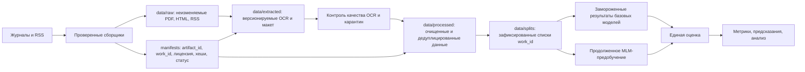
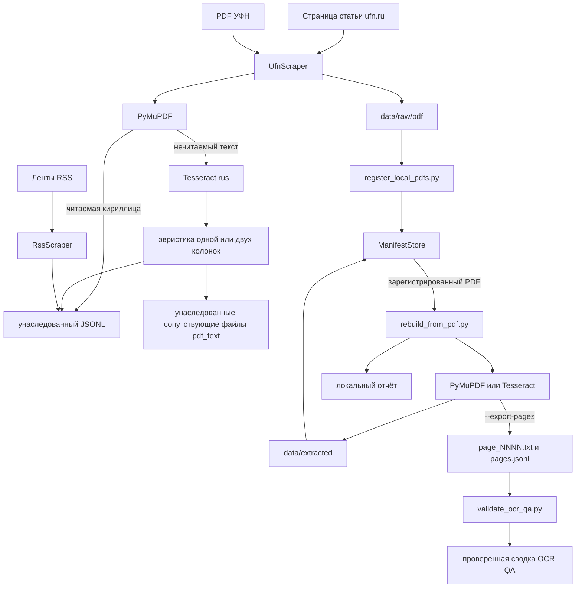

# Архитектура ruPhysBERT

**Студент:** Оберемок Дмитрий  
**Научный руководитель:** Куратов Андрей Сергеевич  
**Репозиторий:** [GitHub](https://github.com/DmitryO325/Development_of_domain-specific_BERT_model_for_analyzing_Russian-language_physical_texts)

## 1. Статус документа

Архитектура следует актуальному [`PLAN.md`](PLAN.md). Именно `PLAN.md` задаёт
границы v1, исследовательский протокол, данные, метрики, обязательные критерии
перехода и порядок этапов. При расхождении документов приоритет имеет план.

Связанные документы:

- [`PLAN.md`](PLAN.md) — единственный источник истины;
- [`GLOSSARY.md`](GLOSSARY.md) — словарь понятий проекта;
- [`OCR_QA_PROTOCOL.md`](OCR_QA_PROTOCOL.md) — протокол ручной проверки OCR;
- [`PARSERS.md`](PARSERS.md) — подробности существующих модулей сбора данных и OCR;
- [`RESOURCES.md`](RESOURCES.md) — литература, модели и источники;
- [`SOURCE_AUDIT.md`](SOURCE_AUDIT.md) — реестр источников, оснований и статусов
  операций;
- [`cards/CORPUS_V1.md`](cards/CORPUS_V1.md) — паспорт и схема корпуса;
- [`H2_LABELING.md`](H2_LABELING.md) — `T_v1` и руководство по разметке H2;
- [`plan_from_google.txt`](plan_from_google.txt) — исторический снимок Google Doc
  от 20.05.2026, не актуальная спецификация;
- [`../README.md`](../README.md) — краткий статус и команды.

## 2. Граница системы и состояние реализации

Цель v1 — проверить, улучшает ли дополнительное предварительное обучение
`ruSciBERT` по задаче MLM на очищенном корпусе русскоязычных журнальных статей
по физике:

1. моделирование физического текста, H1;
2. классификацию подразделов физики, H2;
3. восстановление маскированных терминов в контексте формул, H3, только если
   выполнен критерий качества обработки формул.

В H1 ruPhysBERT сравнивается с исходной `ai-forever/ruSciBERT` при одном
токенизаторе. В H2 обязательны `ai-forever/ruBert-base`,
`ai-forever/ruSciBERT` и ruPhysBERT как `ruSciBERT` после дополнительного
предварительного обучения. Обучение BERT с нуля, лекции/ASR, учебники,
олимпиадные задачи, генерация и информационный поиск не входят в v1.

Текущий код покрывает инженерный прототип частей этапов 2–4:

- `scripts/scrape.py` оркестрирует сбор данных из УФН и RSS;
- `src/collect/ufn.py` обходит выпуски и статьи УФН;
- `src/collect/rss_feed.py` читает RSS;
- `src/collect/pdf_text.py` загружает PDF, запускает PyMuPDF/OCR, применяет
  эвристику порядка чтения и формирует устойчивый постраничный результат;
- `scripts/register_local_pdfs.py` регистрирует вручную полученные PDF по
  явным карточкам и применимым записям прав;
- `scripts/rebuild_from_pdf.py` извлекает текст из зарегистрированных локальных
  PDF, регистрирует дочерние производные артефакты и по явному флагу публикует
  неизменяемый постраничный набор;
- `src/corpus/` назначает идентификаторы, проверяет схемы и целостность данных,
  формирует прямые планы регистрации и через `ManifestStore` ведёт текущие
  снимки, неизменяемые журналы и контент-адресуемые файлы;
- `scripts/validate_manifests.py` проверяет схемы, внешние ключи, пути, размеры,
  хеши и циклы происхождения;
- `src/corpus/ocr_qa_*.py` и `scripts/validate_ocr_qa.py` проверяют формы,
  файлы, связи, ревизии, метрики и вложенный bootstrap одного запуска OCR QA;
- `scripts/freeze_manifests.py` создаёт и сверяет неизменяемую версию всех
  рабочих реестров;
- `tests/test_manifest_*.py` содержит автоматические проверки этого контура;
- `draft/` содержит исследовательские ноутбуки и архивный прототип переноса
  старого `Document`-JSONL, который не входит в активный конвейер.

Этот прототип не является готовым корпусом, конвейером базовых экспериментов
или обученной моделью. Markdown-спецификация корпуса, предварительная `T_v1`,
начальный правовой аудит и программный жизненный цикл реестров уже созданы.
31.08.2026 рабочие реестры впервые заполнены ручным инженерным пилотом УФН:
10 работ, 10 исходных PDF и 10 производных текстов. Все работы относятся к
2026 году. Год больше не исключает их из corpus v1: пять научных кандидатов
имеют статус `pending`, пять материалов неподходящих жанров — `rejected`.
Пилот ещё не допущен по правам и качеству.
Четыре локальные записи прав относятся
только к режимам пилота УФН и не заменяют реестр прав остальных источников. По
умолчанию сетевые сборщики продолжают писать прототипный `Document`-JSONL;
явный `--register-manifests` вместо этого строит `ManifestPlan`, согласует его
с текущим снимком и вызывает `ManifestStore`. До сети проверяются точные записи
прав на получение и хранение. Полные неизменяемые HTTP-доказательства ещё не
передаются от сетевых сборщиков регистратору, поэтому этот режим фиксирует
`metadata_only` и запрещает роль `full_text`. Очистка, дедупликация, разбиения,
обучение и единый конвейер оценки также не реализованы.

## 3. План работ: 12 этапов и точки интеграции

Архитектура привязана к 12 этапам `PLAN.md`:

1. обзор и постановка исследования;
2. проектирование корпуса и аудит источников;
3. сбор неизменяемого корпуса исходных данных;
4. извлечение текста и OCR;
5. разведочный анализ данных (EDA), формулы, токенизатор и контекст;
6. подготовка и фиксация версионированного корпуса v1;
7. фиксация базовых экспериментов;
8. MLM-пилот и дополнительное предобучение;
9. оценка на прикладных задачах и контрольных наборах;
10. абляции;
11. анализ результатов и ограничений;
12. воспроизводимость, отчёт и статья.

Обзор, аудит источников и правового статуса, проектирование корпуса и прототип
модуля разбора/OCR могут идти параллельно. После подготовки данных порядок строгий:

```text
извлечение, прошедшее контроль качества
    → фиксация корпуса v1
    → замороженные наборы оценки и результаты базовых моделей
    → MLM-обучение
    → итоговая оценка
    → абляции и анализ
```

Фиксация корпуса, базовые эксперименты, обучение и окончательная оценка —
обязательные критерии перехода. Нельзя менять корпус или разбиения после
просмотра окончательной тестовой выборки либо выбирать контрольную точку модели
по тестовой выборке. Отрицательный результат эксперимента допустим; нарушение
протокола — нет.

## 4. Целевая архитектура данных



### 4.1 Неизменяемые исходные данные

`data/raw/` хранит исходные байты PDF, HTML и RSS без модификации. Повторный
запуск не должен удалять или перезаписывать сохранённый артефакт. Для каждого
объекта фиксируются источник, URL, дата получения и контрольная сумма.

Существующий прототип исторически пишет JSONL и сопутствующие файлы OCR в
`data/raw/`. Это унаследованное размещение инженерных данных для отладки. Оно
не определяет целевую схему.

### 4.2 Версионированное извлечение

`data/extracted/<extractor-version>/` хранит результаты конкретной версии
прямого извлечения, OCR и обработки макета. Исходный PDF остаётся неизменным.
Каждый результат связан с исходным `artifact_id`, версией модуля извлечения,
его параметрами, статусом контроля качества (QA) и причиной помещения в
карантин при ошибке.

Критерий допуска этапа 4 измеряется на вручную проверенной контрольной выборке
и принимается по односторонним кластерным доверительным интервалам (CI) уровня
95% по странице/`work_id`:

- верхняя граница CER не выше 3%;
- верхняя граница WER не выше 10%;
- верхняя граница доли критических ошибок порядка чтения не выше 5%;
- критерий качества обработки формул рассчитывается отдельно для H3 по доверительному
  интервалу F1 и доле искажений.

### 4.3 Обработанный корпус

`data/processed/<version>/` создаётся воспроизводимо из результатов извлечения,
прошедших контроль качества. Здесь выполняются очистка от шаблонных служебных
фрагментов, нормализация, языковой фильтр, точная и приближённая дедупликация.
Аннотации, RSS-анонсы и полные статьи различаются явно и не смешиваются как
равнозначные обучающие документы.

### 4.4 Стабильные идентификаторы и разбиения

- `artifact_id` идентифицирует конкретное представление: PDF, HTML, RSS,
  результат OCR или другую производную.
- `work_id` объединяет все представления одной научной работы.
- Оба идентификатора назначаются в реестре при загрузке; сопоставление
  сущностей уточняет связи и дубли до фиксации, но производные слои не создают
  новые несвязанные идентификаторы той же работы.
- Разбиение выполняется по `work_id` до нарезки на фрагменты, поэтому PDF, HTML,
  аннотация, RSS, OCR и фрагменты одной работы не могут попасть в разные части.
- `data/splits/` хранит версионированные списки `work_id`, начальное значение
  генератора случайных чисел и контрольную сумму набора данных.

Исходный физический корпус содержит все допущенные к моменту `corpus_cutoff_at` работы,
без фильтра по году и верхнего предела по объёму. После резервирования оценочных работ H2/H3 все
оставшиеся подходящие работы образуют пул H1. Минимальный порог готовности H1 — 2 000 работ.
Весь пул H1 делится по `work_id` в пропорции 80/10/10 на `D_mlm_train`,
`D_mlm_validation` и `D_phys_test`. Для H2 с одной
меткой собираются пять классов по 300 документов; разделение 70/10/20 даёт на
класс 210 обучающих, 30 валидационных и 60 тестовых документов. Все
валидационные и тестовые наборы разных задач взаимно не пересекаются. Допустимо
только заранее объявленное пересечение `D_cls_train` с `D_mlm_train` после
удаления признаков метки. Конкретные списки замораживаются до запуска базовых
экспериментов и обучения, а достаточность объёма проверяется анализом мощности
при `α=0.05` и целевой мощности не ниже 0,80.

### 4.5 Реестр данных

Целевой реестр данных содержит как минимум:

- `artifact_id`, `work_id`, URL, DOI, источник и дату;
- заголовок, авторов и физический класс;
- смысловую роль `content_role`: `full_text`, `title_abstract`,
  `metadata_only` или `formula_context`;
- техническое представление `representation`: `pdf`, `html`, `xml`, `json`,
  `rss`, `plain_text` или `ocr_text`;
- `access_basis`, `basis_type`, ссылка-доказательство и дата проверки;
- `acquisition_method`, `acquisition_scope`, результат проверки
  `robots.txt` и наличие платного или иного ограниченного доступа;
- отдельные логические статусы `acquisition_allowed`, `storage_allowed`, `evaluation_allowed`,
  `ml_training_allowed`, `redistribution_allowed`,
  `derivatives_release_allowed` и `checkpoint_release_allowed` со значениями
  `allowed|conditional|permission_required|prohibited|unknown`;
- в `manifests/rights.jsonl` каждый статус хранится отдельной строкой
  `scope × operation × acquisition_method × acquisition_scope` со своим
  `basis_type`, доказательством и условиями;
- хеш исходного и обработанного представления;
- метод и версию извлечения и предобработки;
- длину, статус обработки и причину ошибки/пропуска.

Документ входит в обучающую выборку только при
`ml_training_allowed=allowed` либо при `conditional` с выполненными и
подтверждёнными условиями. Для закрытого внутреннего некоммерческого
исследования правомерная доступность при отсутствии применимого явного
ограничения фиксируется как
`basis_type=lawful_access_research_assumption` и `ml_training_allowed=conditional`.
Отсутствие отдельного упоминания ML само по себе не блокирует обучение. Это
проектное допущение и осознанный риск, а не юридическое заключение.

`acquisition_allowed` определяется отдельно для конкретных `acquisition_method`
и `acquisition_scope` с учётом `robots.txt`, платного или иного ограниченного доступа и
правил источника. Так же отдельно проверяются `redistribution_allowed`,
`derivatives_release_allowed` и `checkpoint_release_allowed`: внутренний допуск
к обучению не разрешает выпуск корпуса, производных данных или контрольной
точки. Явный применимый запрет имеет приоритет над исследовательским допущением.
Неизвестное или запрещающее значение блокирует соответствующую операцию, а не
автоматически все режимы.

## 5. Существующий прототип сбора данных и OCR

### 5.1 Поток выполнения



Для первой страницы УФН модуль извлечения ищет переход от одноколоночной шапки
к двум колонкам. На следующих страницах OCR обычно читает левую колонку, затем
правую. Это эвристика, а не проверенный измерениями универсальный анализатор
макета.

### 5.2 Промежуточная схема JSONL

Текущий `src/collect/base.py` сохраняет `source`, `url`, `title`, `text`,
`authors`, `published`, `section`, `pdf_url`, `language` и `extra`. В
`extra` могут находиться `text_source`, `pdf_file`, `pdf_path`, метод извлечения
и путь к сопутствующему файлу.

Поле `text` в таком JSONL не означает, что запись допущена в корпус v1. В
промежуточной схеме нет обязательных `artifact_id`, `work_id`, статуса
лицензии, контрольной суммы, статуса контроля качества и версии корпуса; она
также не гарантирует дедупликацию и полноту статьи.

Старый прототип преобразования этой схемы перенесён в `draft/` и больше не
является частью архитектуры проекта. Старые локальные записи не планируется
переносить в рабочие реестры: материалы будут собраны заново по актуальным
правилам. Прямое создание `works`, `artifacts` и связанных журналов уже
реализовано для новых `Document` и зарегистрированных локальных PDF. Записи
`rights` создаются отдельно из проверенных оснований. Для сетевых сборщиков
остаётся подключить передачу точных исходных HTTP-снимков.

## 6. Фактические локальные данные для отладки

Срез на 18.08.2026:

- 100 файлов в `data/raw/pdf/`;
- 100 строк в `data/raw/ufn_100.jsonl`, все с `text_source: html`;
- 10 строк в `data/raw/ufn_10_pdf.jsonl`, все с
  `text_source: pdf_ocr_layout`;
- 30 файлов в `data/raw/pdf_text/`; это несколько вариантов извлечения для
  части PDF, а не 30 независимо проверенных документов;
- 20 строк и 16 уникальных URL в `data/raw/corpus.jsonl`;
- полного `data/raw/ufn_100_pdf.jsonl` нет.

Дополнение на 31.08.2026:

- вручную зарегистрированы 10 PDF УФН и 10 работ 2026 года;
- из 10/10 PDF создан производный текст версии `ufn-pdf-text-v1`;
- рабочие реестры содержат 20 артефактов, 10 событий получения и 4 записи
  прав; извлечение текста не создаёт повторное событие получения;
- предварительная ручная проверка выявила ошибки формул, латиницы и порядка
  чтения, поэтому `qa_status` остаётся `not_evaluated`;
- все десять работ относятся к 2026 году; год больше не исключает их из corpus v1,
  но они не допущены к обучению до подтверждения прав и прохождения критерия качества.

Все перечисленные данные игнорируются Git. Это инженерный набор для отладки,
а не исследовательский корпус или базовый эксперимент. Наличие PDF и рабочего
пилота не закрывает этапы 2–6: ещё нет правового допуска и баланса всех
источников, дедупликации, контрольной выборки OCR, принятого описания corpus v1
и зафиксированных разбиений.

Правила объёма из `PLAN.md`:

- MLM-пилот: 400 обучающих работ, не менее трёх `source_group_id`, около 5 млн
  очищенных подтокенов;
- H1: все допущенные работы в зафиксированном снимке, не менее 2 000; разбиение
  80/10/10, а число подтокенов измеряется по фактическому `D_mlm_train`;
- общенаучный контроль H1: по 300 работ в валидационном и тестовом наборах;
- H2: пять классов ГРНТИ 29.xx по 300 документов, по 210/30/60 на класс;
- H3 при прохождении критерия качества обработки формул:
  `D_formula_test` из 500 согласованных пар минимум по 200 работам и
  `D_formula_validation` из 100 пар минимум по 40 другим работам.

Исходный ориентир обязательной части H1/H2 — 160 GPU-часов и 200 ГБ хранилища;
он пересчитывается по фактическому снимку и не ограничивает число статей. H3
получает отдельный предел 270 GPU-часов и дополнительные 150 ГБ; совокупный
предел проекта с H3 равен 430 GPU-часам и 350 ГБ.

## 7. CLI и известные ограничения

Текущие команды подходят для быстрых инженерных проверок, но ещё не
воспроизводят целевую сборку корпуса. Команды `scrape.py` дополняют выходной
JSONL новыми записями, поэтому каждый их прогон должен получать новый
версионированный путь. `rebuild_from_pdf.py` атомарно записывает пакет в
реестры и отдельной атомарной операцией заменяет локальный отчёт; повторный
запуск не дублирует уже зарегистрированные артефакты.

```bash
python3 scripts/scrape.py ufn \
  --max-docs 10 \
  --pdf-dir data/raw/pdf/ufn_smoke_20260818 \
  --pdf-text-dir data/extracted/ufn_smoke_20260818 \
  -o data/raw/ufn_smoke_20260818.jsonl

python3 scripts/scrape.py rss \
  --limit 30 \
  -o data/raw/rss_smoke_20260818.jsonl

python3 scripts/register_local_pdfs.py \
  manifests/imports/ufn_manual_20260831.jsonl \
  --profile ufn \
  --rights-record-id rights_ufn_manual_sample_acquisition_20260830 \
  --rights-record-id rights_ufn_storage_20260830

python3 scripts/rebuild_from_pdf.py \
  manifests/imports/ufn_manual_20260831.jsonl \
  --extraction-version ufn-pdf-text-v1 \
  --export-pages \
  --page-output-dir data/qa/ocr/page_exports

python3 scripts/validate_ocr_qa.py \
  --run manifests/ocr_qa/RUN_ID/ocr_qa_run.json \
  --summary manifests/ocr_qa/RUN_ID/ocr_qa_summary.json
```

Ограничения:

- ошибка аргументов `python3 scripts/scrape.py pilot` исправлена и покрыта
  регрессионным тестом; команда остаётся малым сетевым прогоном, а рабочие
  реестры задействует только при явном `--register-manifests`;
- `--fresh` очищает выходной файл перед первой успешной записью и поэтому не
  должен применяться к сохраняемым исходным данным; в прямом режиме этот флаг отклоняется;
- прямой режим `scrape.py` фиксирует фактический `crawler|sample` или `crawler|bulk`,
  заранее учитывает более узкие запреты известных работ/артефактов и повторяет
  согласование при CAS-гонке без повторной загрузки;
- прототипный режим дозаписи не предотвращает дубли; прямой режим устраняет
  точные повторы и согласует повторные получения по ID и хешам;
- сборщик ещё не передаёт полное неизменяемое содержимое HTML/RSS в
  `HttpResponseSnapshot`, хотя базовый HTTP-слой умеет его формировать;
- УФН — единственный подключённый источник полных статей; RSS содержит анонсы,
  а не эквивалентный корпус полных текстов;
- постраничный экспорт и машинная проверка OCR QA реализованы, но реальные
  варианты из зафиксированного паспорта, изображения страниц и эталонная
  разметка ещё не созданы; поэтому CER/WER, порядок чтения и формулы не прошли
  критерий допуска;
- `ManifestStore` и модульные проверки созданы, но отсутствуют активный сквозной
  путь `сборщик → неизменяемые HTTP-байты → ManifestPlan → ManifestStore`,
  сохраняемое состояние повторных попыток и возобновления, а также полноценный
  журнал ошибок этапа 3.

## 8. Целевая структура репозитория

```text
data/raw/                  # неизменяемые PDF/HTML/RSS
data/extracted/            # версионируемые результаты OCR и извлечения
data/processed/<version>/  # очищенный и дедуплицированный корпус
data/splits/               # версионируемые списки work_id
manifests/                 # реестры источников и корпуса, контрольные суммы
configs/data/              # конфигурации сбора и предобработки
configs/train/             # конфигурации MLM и классификации
configs/eval/              # замороженные протоколы оценки
src/collect/               # сборщики источников
src/corpus/                # ID, профили, схемы, проверка и запись реестров
src/extract/               # извлечение из PDF, OCR и обработка макета
src/preprocess/            # нормализация, дедупликация и разбиение на фрагменты
src/train_mlm.py
src/train_cls.py
src/evaluate.py
tests/fixtures/            # небольшие воспроизводимые контрольные примеры источников
tests/                     # тесты модулей разбора, OCR, разбиений и оценки
artifacts/experiments/     # конфигурации, журналы, метрики и предсказания
notebooks/                 # разведочный и последующий анализ данных
docs/cards/                # паспорта корпуса и модели
reports/                   # графики и итоговые отчёты
```

Это в основном целевая структура из `PLAN.md`. На сегодня реализованы
`src/collect/`, `src/corpus/` с идентификацией, прямой регистрацией, жизненным
циклом `DEC-013` и проверкой OCR QA, команды проверки и фиксации реестров,
команды сбора и пересборки PDF, постраничный экспорт, модульные тесты и
локальные исследовательские блокноты в исключённом из Git `draft/`. Импорт
старого JSONL не входит в активный конвейер: новые результаты можно
регистрировать только из текущего объекта `Document` при явно выбранном режиме.

## 9. Ближайшая цель

Ближайшая цель — выполнить критерии перехода этапов 2–4, а не запускать MLM:

1. зафиксировать реестр источников, правовой статус, роли `full_text`,
   `abstract`, RSS и минимальные объёмы;
2. перенести подтверждённые основания в `rights.jsonl` и подключить фактические
   `HttpResponseSnapshot` от УФН и RSS к уже реализованному регистратору;
3. сделать массовый сбор исходных данных неизменяемым и повторяемым, добавить
   тестовые данные и проверки каждого источника;
4. зафиксировать паспорт реального запуска OCR QA и воспроизводимо сформировать
   объявленные варианты с явными языками, DPI, конфигурациями и `variant_id`;
5. экспортировать страницы и изображения, создать эталонную разметку, затем
   проверить CER/WER, порядок чтения и формулы уже реализованным валидатором;
6. только после этого выполнить разведочный анализ данных, дедупликацию, аудит
   утечки данных и зафиксировать корпус v1.

Переход к этапу 7 разрешён только после получения воспроизводимого корпуса v1 и
зафиксированных разбиений. Переход к этапу 8 — только после сохранения
конфигураций базовых экспериментов, предсказаний на валидационной выборке и
результатов; окончательные тестовые наборы при этом остаются закрытыми до
этапа 9.
