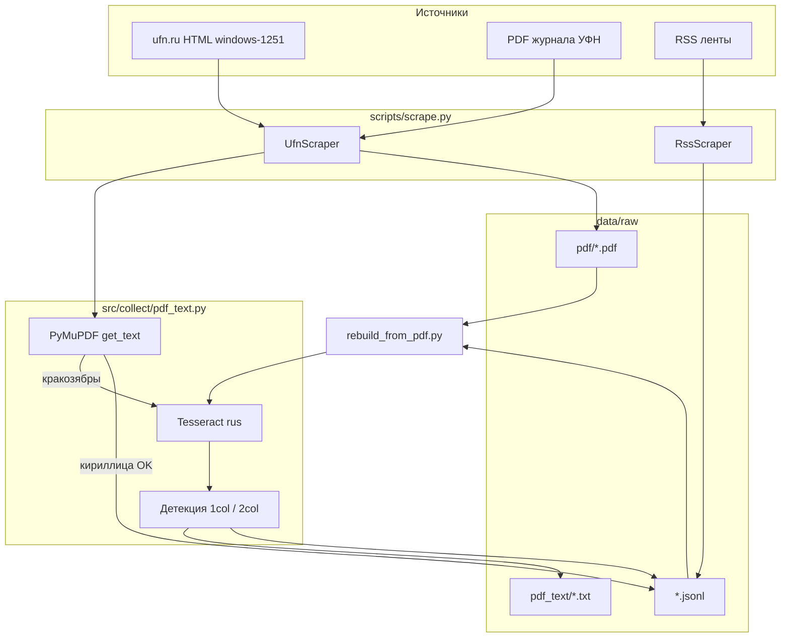

# Архитектура проекта и текущий статус (НИР)

**Студент:** Оберемок Дмитрий  
**Научный руководитель:** Куратов Андрей Сергеевич  
**Репозиторий:** https://github.com/DmitryO325/Development_of_domain-specific_BERT_model_for_analyzing_Russian-language_physical_texts

Связанные документы:
- [План НИР (этапы, гипотезы, модели)](PLAN.md)
- **[Парсеры: подробное описание](PARSERS.md)** — ufn, RSS, PDF/OCR, CLI, Colab vs repo
- [Ресурсы и ссылки](RESOURCES.md)
- [Полная выгрузка Google Doc](plan_from_google.txt)

---

## 1. Цель проекта (кратко)

Построить **доменно-специализированную** языковую модель (рабочее имя **ruPhysBERT**) для русскоязычных физических текстов: continued pretraining / fine-tune поверх **ruSciBERT** (основной кандидат) с сравнением **ruBERT**, метриками MLM и классификации.

Сейчас в репозитории реализован **этап 2–3 частично**: сбор корпуса с ufn.ru, скачивание PDF, извлечение текста (OCR + учёт двухколоночной вёрстки).

---

## 2. Что уже сделано / что впереди

| Этап (из [PLAN.md](PLAN.md)) | Содержание | Статус | Артефакты в репо |
|------------------------------|------------|--------|------------------|
| **1** | Обзор моделей и подходов | В работе | `draft/rubert.ipynb`, `draft/ruscibert.ipynb`, `docs/RESOURCES.md` |
| **2** | Сбор корпуса RU физ. текстов | **Частично** | `scripts/scrape.py`, `src/collect/`, ~100 PDF УФН |
| **3** | Извлечение текста из PDF/OCR | **Частично** | `src/collect/pdf_text.py`, `scripts/rebuild_from_pdf.py` |
| **4** | Формулы, EDA | Не начато | — |
| **5** | MLM / обучение | Не начато | — |
| **6–8** | Метрики, абляции, статья | Не начато | — |

### Реализовано в коде (детально)

| Компонент | Описание |
|-----------|----------|
| **Парсер ufn.ru** | Обход выпусков `/ru/articles/YYYY/N/`, страницы статей, метаданные, ссылка на PDF |
| **Скачивание PDF** | Кэш в `data/raw/pdf/`, имена вида `r265b.pdf` |
| **Извлечение текста** | PyMuPDF (raw) → при кракозябрах Tesseract OCR |
| **Двухколоночная вёрстка** | Стр. 1: шапка 1 кол. → 2 кол.; стр. 2+: сразу 2 кол. (слева целиком, потом справа) |
| **RSS** | Ленты УФН и «Квантовая электроника» |
| **Формат корпуса** | JSONL, одна строка = один документ |
| **Пересборка из PDF** | Без повторного crawl — только OCR по уже скачанным файлам |

### Ещё не сделано

- Парсеры других сайтов (ЖЭТФ, sciencejournals.ru, …)
- `data/processed/`, очистка, дедупликация, реестр корпуса
- `src/preprocess.py`, `src/train_mlm.py`, обучение ruPhysBERT
- Обработка формул, кастомный токенизатор
- Colab-ноутбук `draft/ru_phys_BERT.ipynb` — **не перенесён** в `src/` (логика частично продублирована в Python-модулях)

---

## 3. Структура репозитория

```
НИР/
├── docs/
│   ├── PLAN.md              # план НИР по этапам
│   ├── ARCHITECTURE.md      # этот файл
│   ├── RESOURCES.md         # ссылки на модели и источники
│   └── plan_from_google.txt
├── scripts/
│   ├── scrape.py            # CLI: ufn | rss | pilot
│   └── rebuild_from_pdf.py  # OCR по уже скачанным PDF → новый JSONL
├── src/collect/
│   ├── base.py              # Document, HTTP, JSONL
│   ├── ufn.py               # парсер УФН
│   ├── pdf_text.py          # PDF, OCR, layout
│   └── rss_feed.py          # RSS
├── data/raw/                # локально, в .gitignore
│   ├── corpus.jsonl         # пилот (~20 записей)
│   ├── ufn_100.jsonl        # 100 статей (метаданные + текст)
│   ├── ufn_10_pdf.jsonl     # подмножество с OCR-текстом
│   ├── pdf/*.pdf            # бинарники PDF
│   └── pdf_text/*.txt       # sidecar-тексты для проверки
├── draft/                   # ноутбуки (ruBERT, ruSciBERT, Colab-парсер)
├── requirements.txt
└── README.md
```

**В git попадает:** код, документация, `draft/`.  
**Не в git:** `data/raw/*.jsonl`, `data/raw/pdf/`, `data/raw/pdf_text/` (см. `.gitignore`).

---

## 4. Как работает пайплайн (схема)



### Два прохода по данным

1. **Сбор (`scrape.py ufn`)** — для каждой статьи: HTML-страница (метаданные) + скачивание PDF + попытка извлечь текст. Результат: `ufn_100.jsonl` и 100 файлов в `pdf/`.
2. **Пересборка (`rebuild_from_pdf.py`)** — читает JSONL, для каждой записи с `pdf_file` заново гоняет `extract_best_text()` (с актуальной логикой OCR/layout) и пишет новый JSONL (например `ufn_100_pdf.jsonl`).

---

## 5. Формат документа (JSONL)

Одна строка = один JSON-объект (`src/collect/base.py` → `Document`):

| Поле | Тип | Назначение |
|------|-----|------------|
| `source` | str | `"ufn.ru"` или `"ufn.ru:rss"` |
| `url` | str | Страница статьи на сайте |
| `title` | str | Заголовок |
| `text` | str | **Основной текст для BERT** |
| `authors` | list[str] | Авторы (если удалось с HTML) |
| `section` | str \| null | Рубрика журнала |
| `pdf_url` | str \| null | Прямая ссылка на PDF |
| `language` | str | `"ru"` |
| `extra` | object | Служебные поля (см. ниже) |

### Поля `extra` (типичные)

| Ключ | Пример | Смысл |
|------|--------|--------|
| `text_source` | `html`, `pdf`, `pdf_ocr_layout` | Откуда взят `text` |
| `pdf_file` | `r265b.pdf` | Имя файла в `data/raw/pdf/` |
| `pdf_path` | абсолютный путь | Где лежит PDF локально |
| `pdf_extract_method` | `pdf_ocr_layout` | Метод извлечения |
| `pdf_text_file` | путь к `.txt` | Sidecar для ручной проверки |
| `pdf_unreadable` | true | PDF не дал читаемую кириллицу → fallback HTML |
| `issue_path` | `/ru/articles/2026/5/` | Выпуск журнала |
| `year` | `"2026"` | Год выпуска |

---

## 6. Особенности ufn.ru (важно для отчёта)

| Факт | Следствие |
|------|-----------|
| HTML в `class="main"` | Только **вступление** (~2–4 тыс. символов), не полная статья |
| PDF с полным текстом | **1–2 колонки**, формулы, шрифты без Unicode-CMap |
| `get_text()` из PyMuPDF | Часто **кракозябры** → нужен **Tesseract** (`rus`) |
| Первая страница PDF | Сверху **одна колонка** (название, аннотация, PACS, DOI), ниже **две колонки** |
| Страницы 2+ | Обычно **две колонки** с верха |

### Логика OCR и вёрстки (`pdf_text.py`)

1. **Проверка читаемости:** доля кириллических букв ≥ 12%, длина ≥ 500 символов.
2. **Если raw PDF читаем** → метод `pdf`, без OCR.
3. **Иначе OCR** (`extract_text_from_pdf_ocr`):
   - **Страница 0:** по grayscale-скану ищется первая устойчивая «щель» между колонками (не раньше 20% высоты). Выше — OCR на всю ширину; ниже — левая половина, затем правая.
   - **Страницы 1+:** сразу левая колонка целиком, потом правая.
4. Sidecar: `data/raw/pdf_text/{stem}_pdf_ocr_layout.txt` с заголовком-метаданными.

---

## 7. CLI: команды

### Установка

```bash
pip install -r requirements.txt
brew install tesseract tesseract-lang   # macOS, для OCR
```

### Сбор корпуса

```bash
# Пилот: 1 выпуск УФН + RSS → data/raw/corpus.jsonl
python scripts/scrape.py pilot

# 100 статей УФН (PDF + fallback HTML)
python scripts/scrape.py ufn --max-docs 100 --fresh -o data/raw/ufn_100.jsonl

# Только HTML (короткий текст со страницы)
python scripts/scrape.py ufn --text-source html --max-docs 20

# RSS
python scripts/scrape.py rss --limit 30 -o data/raw/corpus.jsonl
```

**Параметры `ufn`:** `--text-source pdf+html|pdf|html`, `--max-issues`, `--max-docs`, `--no-ocr`, `--pdf-dir`, `--pdf-text-dir`.

### Пересборка текста из PDF

```bash
python scripts/rebuild_from_pdf.py \
  -i data/raw/ufn_100.jsonl \
  -o data/raw/ufn_100_pdf.jsonl \
  --fresh

# Тест на 10 статей
python scripts/rebuild_from_pdf.py -i data/raw/ufn_100.jsonl -o data/raw/ufn_10_pdf.jsonl -n 10 --fresh
```

---

## 8. Текущие объёмы (локально, май 2026)

| Артефакт | Количество |
|----------|------------|
| `data/raw/pdf/*.pdf` | ~100 |
| `data/raw/ufn_100.jsonl` | 100 строк |
| `data/raw/ufn_10_pdf.jsonl` | 4 строки (после последнего OCR-прогона) |
| `data/raw/corpus.jsonl` | ~20 (пилот) |
| `data/raw/pdf_text/*.txt` | ~24 sidecar-файла |

> Часть записей в `ufn_100.jsonl` может иметь `text_source: html`, если OCR ещё не перезапускали после доработки layout.

---

## 9. Модули (краткий справочник)

Подробно: **[`docs/PARSERS.md`](PARSERS.md)**.

| Модуль | Ответственность |
|--------|-----------------|
| `base.py` | `Document`, `fetch_html` / `fetch_bytes`, `append_jsonl`, нормализация пробелов |
| `ufn.py` | `UfnScraper`: выпуски → статьи → HTML + `pdf_to_text` |
| `pdf_text.py` | URL PDF, download, raw/OCR, layout split, `extract_best_text` |
| `rss_feed.py` | Парсинг RSS → `Document` |
| `scrape.py` | CLI, оркестрация |
| `rebuild_from_pdf.py` | Повторное извлечение текста из кэша PDF |

---

## 10. Известные ограничения

- OCR медленный и шумный (формулы, сноски, качество скана).
- Детекция границы 1col/2col на стр. 1 — эвристика по изображению; на отдельных статьях граница может съехать на ±5–10%.
- HTML-текст без PDF — **неполный** корпус для MLM полных статей.
- Один источник (УФН); остальные журналы из плана — не подключены.
- Данные не коммитятся в git — для воспроизведения нужен повторный `scrape`.

---

## 11. Ближайшие шаги (согласовано с планом)

1. **Догнать OCR:** `rebuild_from_pdf.py` на все 100 PDF → `ufn_100_pdf.jsonl` с `text_source: pdf_ocr_layout`.
2. **Проверка качества:** выборочно сравнить `pdf_text/*.txt` с PDF; оценить долю читаемых статей.
3. **Реестр корпуса:** CSV/JSON с метаданными (источник, год, рубрика, длина, метод извлечения).
4. **Расширение источников:** адаптировать шаблон `UfnScraper` под другой журнал.
5. **EDA + pilot MLM:** ноутбук, ruSciBERT vs ruBERT на fill-mask / perplexity.

---

## 12. Связь с черновиками Colab

| Файл | Роль |
|------|------|
| `draft/ru_phys_BERT.ipynb` | Исходный Colab: пути PDF, `download_pdf` — **референс**, не основной пайплайн |
| `draft/rubert.ipynb`, `draft/ruscibert.ipynb` | Знакомство с baseline-моделями |

Актуальный пайплайн сбора — **`scripts/scrape.py`** + **`src/collect/`**.
