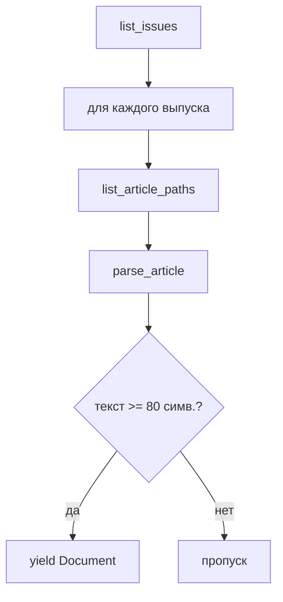

# Сборщики корпуса и модули разбора: подробное описание

Документ описывает **фактически реализованные модули сбора, извлечения текста и
базовые средства проверки реестров**: какие материалы разбираются, как устроены
URL, какие поля попадают в прототипный JSONL и какие сведения ожидают целевые
реестры, ограничения и отличия от блокнота Colab.

См. также: [ARCHITECTURE.md](ARCHITECTURE.md) (общая схема), [PLAN.md](PLAN.md) (этапы НИР).

---

## 1. Обзор модулей

| Модуль | Файл | Тип | Назначение |
|--------|------|-----|------------|
| **База** | `src/collect/base.py` | утилиты | HTTP, `Document`, HTML→текст, JSONL |
| **УФН** | `src/collect/ufn.py` | сборщик сайта | ufn.ru: выпуски → статьи → HTML + PDF |
| **PDF/OCR** | `src/collect/pdf_text.py` | извлечение текста | Скачивание PDF, прямое извлечение/OCR, 2 колонки и постраничный экспорт |
| **RSS** | `src/collect/rss_feed.py` | лента | WordPress/RSS/Atom |
| **CLI** | `scripts/scrape.py` | управляющий модуль | `ufn`, `rss`, `pilot` |
| **Пересборка** | `scripts/rebuild_from_pdf.py` | пакетная обработка | извлечение и регистрация производных текстов из зарегистрированных PDF |
| **Реестры** | `src/corpus/` | данные корпуса | ID, профили, прямые планы регистрации, JSON Schema и жизненный цикл |
| **Проверка** | `scripts/validate_manifests.py` | проверка | схемы, ссылки, пути, размеры и SHA-256 |
| **Проверка OCR** | `scripts/validate_ocr_qa.py` | проверка | связи, файлы, метрики и bootstrap запуска OCR QA |
| **Фиксация** | `scripts/freeze_manifests.py` | управляющий модуль | неизменяемая версия всех рабочих реестров |

Локальный `draft/` — игнорируемый Git архив прежнего импортёра и
исследовательских блокнотов. Его файлы не входят в активные модули или
отслеживаемую структуру репозитория.

### 1.1. Статус: инженерный прототип

Сейчас код умеет найти часть материалов, скачать PDF, извлечь текст и сохранить прототипные JSONL-файлы и сопроводительные текстовые файлы. Наличие этих артефактов ещё не означает, что собран версионированный корпус, обучена базовая модель или получена воспроизводимая научная оценка.

Целевая раскладка данных из [PLAN.md](PLAN.md):

```text
data/raw/        # неизменяемые исходные PDF/HTML/RSS
data/extracted/  # версионированный результат извлечения из PDF и OCR
data/processed/  # очистка, нормализация и дедупликация
data/splits/     # версионированные списки work_id для обучающей, валидационной и тестовой выборок
```

Содержимое `data/raw/` считается **неизменяемым**: исходники не перезаписываются после скачивания. Любое извлечение и преобразование должно создавать отдельный воспроизводимый производный слой с версией метода, конфигурацией и хешами входов.

В текущем прототипе часть извлечённого текста и JSONL ещё записывается внутри
`data/raw/`. Это описание текущего поведения, а не целевая архитектура.
Программная основа `artifact_id`, `work_id`, текущих снимков и неизменяемых
журналов уже создана. 31.08.2026 в рабочие реестры внесён ручной инженерный
пилот УФН из 10 работ и 10 исходных PDF; для каждого PDF зарегистрирован
отдельный производный текст в `data/extracted/`. Год выпуска — 2026 — сам по
себе не исключает эти работы. Пять научных кандидатов возвращены в `pending`,
пять материалов неподходящих жанров оставлены в `rejected`. Однако пилот пока
не допущен к обучению: для него
не зафиксировано разрешение операции `ml_training` в требуемом масштабе и не
пройден критерий качества OCR. По умолчанию сетевые сборщики сохраняют
прототипный JSONL; с явным `--register-manifests` они формируют `ManifestPlan`
и вызывают `ManifestStore`. Пока они не передают регистратору точный
`HttpResponseSnapshot`, поэтому прямой сетевой режим создаёт `metadata_only` и
не допускает роль `full_text`. Построитель очищенного слоя, дедупликации и
версионированных разбиений ещё не реализован.

Корпус не ограничивается заранее заданным диапазоном годов или максимальным
числом работ. Состав каждой версии определяется снимком реестров на
зафиксированные дату и время и подтверждается хешами манифестов. Материалы,
зарегистрированные после этой контрольной точки, относятся к следующей версии.

---

## 2. Базовый слой (`base.py`)

### 2.1. `Document`

Единая структура прототипной записи (класс данных):

```python
@dataclass
class Document:
    source: str          # "ufn.ru", "ufn.ru:rss", "quantum-electronics.ru:rss"
    url: str             # канонический URL статьи
    title: str
    text: str            # основной текст для ML
    authors: list[str]   # по умолчанию []
    published: str | None
    section: str | None  # рубрика журнала / категория RSS
    pdf_url: str | None
    language: str        # "ru"
    extra: dict          # служебные поля парсера
```

Сериализация: `doc.to_dict()` → одна строка JSONL через `append_jsonl(doc, path)`.

Этот класс данных отражает только текущий прототипный формат. В версии, пригодной для корпуса, к записи должны быть привязаны как минимум стабильные `artifact_id` и `work_id`, источник/URL/DOI, `access_basis`, `basis_type`, `acquisition_method`, `acquisition_scope` и отдельные статусы получения, хранения, оценки, обучения моделей, распространения, публикации производных данных и контрольной точки, хеш исходника, версия модуля извлечения/OCR и предобработки, статус или ошибка обработки и принадлежность к части разбиения. Эти сведения должны храниться в реестре данных, а не восстанавливаться из имени файла.

### 2.2. HTTP

- **`fetch_bytes(url)`** — бинарные данные (PDF), предельное время ожидания 120 с, до 3 повторов.
- **`fetch_html(url, encoding=...)`** — декодирование в строку.
- **User-Agent:** `NIR-corpus-bot/0.1 (+academic research; contact via GitHub DmitryO325)`.
- Между запросами модули сбора сами делают `time.sleep(delay_seconds)` (у УФН по умолчанию 1 с).

Наличие функции загрузки не означает допуска конкретного режима сбора. До её
применения отдельно фиксируются `acquisition_method`, `acquisition_scope`, правила
`robots.txt`, платный или иной ограниченный доступ и явные запреты источника.
Статус `conditional` с
`basis_type=lawful_access_research_assumption` относится только к закрытому
внутреннему некоммерческому исследованию и не подменяет проверку получения или
публикации результатов.

### 2.3. `html_to_text(fragment)`

Грубая очистка без BeautifulSoup (в отличие от Colab):

1. Удалить `<!-- -->`, `<script>`, `<style>`
2. `<br>` → перевод строки
3. Закрывающие `</p>`, `</div>`, … → перевод строки
4. Остальные теги → пробел
5. `html.unescape`, схлопывание пробелов и пустых строк

Подходит для RSS-описаний и блока `class="main"` на ufn.ru.

---

## 3. Сборщик УФН (`ufn.py`)

### 3.1. Класс `UfnScraper`

```python
UfnScraper(
    delay_seconds=1.0,
    text_mode="pdf+html",      # html | pdf | pdf+html
    pdf_dir="data/raw/pdf",
    pdf_text_dir="data/raw/pdf_text",
    min_pdf_chars=500,
    try_ocr=True,
)
```

| Параметр | Значение по умолчанию | Смысл |
|----------|----------------------|--------|
| `text_mode` | `pdf+html` | Сначала PDF; если нечитаемо — HTML-вступление |
| `min_pdf_chars` | 500 | Минимальная длина текста из PDF, иначе используется запасной источник |
| `try_ocr` | True | Tesseract, если `get_text()` даёт кракозябры |

**Кодировка сайта:** `windows-1251` (обязательно для HTML ufn.ru).  
**RSS УФН:** `utf-8` (`/ru/articles/rss.xml`).

### 3.2. Иерархия URL на ufn.ru

Три уровня (как в Colab, но реализовано в одном классе):

```
https://ufn.ru/ru/articles/                    ← архив выпусков
https://ufn.ru/ru/articles/2026/5/             ← страница выпуска (список статей a, b, c…)
https://ufn.ru/ru/articles/2026/5/a/           ← страница статьи (HTML)
https://ufn.ru/ufn2026/ufn2026_5/Russian/r265a.pdf ← PDF полного текста
```

**Правило имени PDF** (если ссылка не найдена в HTML):

```
/ru/articles/{YYYY}/{VOL}/{letter}/
  → https://ufn.ru/ufn{YYYY}/ufn{YYYY}_{VOL}/Russian/r{YY}{VOL}{letter}.pdf

Пример: /ru/articles/2026/5/a/ → r265a.pdf
```

Функция: `pdf_url_from_article_path()` в `pdf_text.py`. Правило закреплено
регрессионным тестом на пути `/ru/articles/2026/5/a/`.

### 3.3. Алгоритм обхода (`iter_articles`)



1. **`list_issues(limit)`** — GET `/ru/articles/`, регулярное выражение
   `href="(/ru/articles/\d{4}/\d+/?)"`, числовая сортировка по году и номеру
   выпуска от новых к старым.
2. **`list_article_paths(issue_path)`** — GET страницы выпуска, регулярное выражение
   `href="(/ru/articles/YYYY/N/[a-z]/?)"`, при наличии — заголовок из текста ссылки.
3. **`parse_article(path)`** — одна статья → `Document | None`.
4. Лимиты: `max_issues`, `max_articles_per_issue`, `max_docs` (остановка после N успешных статей).

**Важно:** при `--max-docs 100` и без `--max-issues` обход идёт по **всем выпускам из архива**, пока не наберётся 100 статей (исправление старой ошибки с `max_issues=2` по умолчанию).

> Это описание технической возможности, а не разрешение на запуск. Для УФН
> режим `crawler|bulk` имеет `acquisition_allowed=permission_required`; до
> письменного разрешения допустима только правомерно полученная ручная
> исследовательская выборка `manual_download|sample`.

### 3.4. Разбор HTML-страницы статьи (`_parse_article_html`)

| Шаг | Действие |
|-----|----------|
| 1 | Найти блок `class="main"` (при наличии — `id="print"`) |
| 2 | Обрезать по маркеру `© Успехи` (нижняя часть страницы) |
| 3 | Извлечь `href="....pdf"` → `pdf_url`, иначе построить по пути |
| 4 | `html_to_text` + `_drop_nav_prefix` → короткий текст |
| 5 | `_extract_title`, `_extract_authors`, `_extract_section` |
| 6 | `extra`: `issue_path`, `year` |

**Что попадает в HTML-текст:** аннотация, вводный абзац, PACS, DOI, ссылки на скачивание PDF — **не полная статья** (обычно 2–4 тыс. символов).

### 3.5. Извлечение метаданных

| Поле | Метод | Логика |
|------|--------|--------|
| **title** | `_extract_title` | Первые осмысленные строки обычного текста (≥12 симв.), без «выпуски», месяцев; запасной вариант — `<b>...</b>` |
| **authors** | `_extract_authors` | Регулярное выражение по `<b>Иванов И. И. Петров</b>` в первых 8000 символах HTML |
| **section** | `_extract_section` | Одна из рубрик: «Обзоры актуальных проблем», «Конференции и симпозиумы», … |

PACS/DOI **в отдельные поля JSONL не выносятся** (в Colab были `info_pacs_list`, `info_doi_list`); они остаются внутри `text` при HTML-режиме или в OCR-тексте первой страницы PDF.

Для H2 это потенциальная утечка целевой метки: PACS, ГРНТИ, название рубрики и другие
прямые подсказки должны удаляться из `title + abstract` до обучения и
проверяться отдельной проверкой на утечки. Поле `section` текущего прототипа — рубрика
журнала, а не готовая целевая метка `T_v1`.

### 3.6. Режимы `text_mode`

| Режим | Поведение |
|-------|-----------|
| **`html`** | Только `_parse_article_html` → `text`, `text_source: html` |
| **`pdf`** | Только PDF; при ошибке/нечитаемости → `None` или пропуск |
| **`pdf+html`** (по умолчанию) | `pdf_to_text()` → если успешно и ≥ `min_pdf_chars` → PDF; иначе HTML, `pdf_unreadable: true` |

Дополнительная проверка: если метод вернул `pdf`, но `is_readable_russian()` = False → снова HTML.

Цепочка вызова PDF: `parse_article` → `pdf_to_text()` → `download_pdf` + `extract_best_text()` (см. раздел 4).

### 3.7. RSS внутри УФН (`parse_rss`)

- URL: `https://ufn.ru/ru/articles/rss.xml`
- Поля: `title`, `link`, `description` (HTML → text), `pubDate`
- `source`: `ufn.ru:rss`
- `extra.format`: `rss_description`
- **Без PDF** — только анонс из ленты.

### 3.8. Поля `extra` для УФН (типичные)

| Ключ | Когда | Пример |
|------|-------|--------|
| `text_source` | всегда | `html`, `pdf`, `pdf_ocr_layout`, `pdf_unreadable` |
| `issue_path` | из URL | `/ru/articles/2026/5/` |
| `year` | из URL | `"2026"` |
| `pdf_file` | при PDF | `r265b.pdf` |
| `pdf_path` | локальный путь | абсолютный путь к файлу |
| `pdf_extract_method` | при PDF | `pdf`, `pdf_ocr_layout`, `pdf_unreadable` |
| `pdf_text_file` | сопроводительный файл | `.../r265b_pdf_ocr_layout.txt` |
| `pdf_unreadable` | при переходе на запасной источник | `true` |
| `pdf_error` | исключение при PDF | строка ошибки |

### 3.9. Очистка мусора (`_drop_nav_prefix`)

На ufn.ru в HTML иногда попадает мусор из комментариев (спам-ссылки). Фильтр:

- явные технические хвосты `Ud%` и `-->` удаляются во всём тексте;
- `mail\d` фильтруется только до начала статьи;
- в начале пропускаются «выпуски», стрелки, голый год, названия месяцев;
- короткие заголовки, адреса с `@` и формулы в `$...$` сохраняются.

---

## 4. Извлечение текста из PDF (`pdf_text.py`)

Это **не модуль разбора HTML**, а подсистема для бинарных PDF журнала УФН (и потенциально других источников с тем же API).

### 4.1. Зависимости

| Пакет / программа | Роль |
|-------------------|------|
| **pymupdf** (`fitz`) | Открытие PDF, растеризация страниц в `pixmap` |
| **pytesseract** + **Tesseract** | OCR, язык `rus` |
| **Pillow** | PNG из растрового изображения (`pixmap`) для Tesseract |

Установка OCR (macOS): `brew install tesseract tesseract-lang`

### 4.2. Конвейер `extract_best_text_result(pdf_path)`

```
extract_text_from_pdf()     # PyMuPDF page.get_text("text")
        │
        ├─ is_readable_russian? ──да──► метод "pdf", файл *_pdf.txt
        │
        нет (кракозябры на УФН)
        │
        ▼
extract_text_from_pdf_ocr()  # Tesseract + учёт макета
        │
        ├─ читаемо? ──► "pdf_ocr_layout", readable=True
        ├─ длина ≥ 500? ──► "pdf_ocr_layout", readable=False
        │
        ▼
"pdf_unreadable" + сопутствующий файл *_pdf_unreadable.txt
```

`extract_best_text_result()` возвращает `PdfTextExtraction`: общий текст,
название применённого метода, признак читаемости и отдельный результат каждой
физической страницы. Совместимая функция `extract_best_text()` оставлена для
старых вызывающих модулей и возвращает прежний кортеж
`(text, method, readable)`.

**Критерий читаемости:** ≥ 200 символов и доля кириллических букв среди всех букв ≥ **12%** (`MIN_CYRILLIC_RATIO`).

### 4.3. Почему нужен OCR на УФН

PDF УФН использует встроенные шрифты **без Unicode CMap**. `page.get_text()` возвращает латиницу/мусор вместо кириллицы. Прямое извлечение почти никогда не проходит `is_readable_russian()` → всегда ветка OCR.

### 4.4. Двухколоночная вёрстка и первая страница

**Проблема:** Tesseract по умолчанию читает строки слева направо через всю ширину → текст левой и правой колонки перемешивается.

**Решение:**

| Страница | Режим |
|----------|--------|
| **0 (первая)** | Определение `split_y`: где начинается промежуток между колонками (после блока PACS/DOI, ~50% высоты). **Выше** `split_y` — OCR на **всю ширину** (шапка). **Ниже** — сначала **левая** половина, потом **правая**. |
| **1+** | Сразу **левая колонка целиком**, затем **правая** (`split_y = None`). |

**Определение промежутка между колонками (только на первой странице):**

- скан страницы в оттенках серого с разрешением 150 DPI;
- горизонтальные полосы по 12 px, начиная с **20%** высоты;
- оценка = (чернила слева + справа) / (чернила в центре 42–58% ширины);
- если оценка ≥ 8 два раза подряд → граница двух колонок;
- отступ `SPLIT_MARGIN_PT = 10` pt вниз.

**Разрез колонок:** середина страницы 50%, зазор между колонками `COLUMN_GUTTER_PT = 14` pt.

**OCR:** DPI **200**, Tesseract `--psm 6` (блок текста), язык `rus`.

### 4.5. Постобработка `_clean_pdf_lines`

Только на верхней и нижней границе каждой PDF-страницы удаляются
строки из 1–3 цифр. Отдельные числа и годы внутри текста сохраняются.

### 4.6. Сопроводительные текстовые файлы

Путь: `data/raw/pdf_text/{stem}_{method}.txt`

Примеры имён метода:

| Значение `method` | Содержание |
|--------|------------|
| `pdf` | Успешный `get_text` (редко на УФН) |
| `pdf_ocr_layout` | OCR с учётом разметки страницы |
| `pdf_unreadable` | Нечитаемый текстовый слой, OCR не помог |

Заголовок файла: метод, имя PDF, число символов, пометка о разметке страницы.

### 4.7. `pdf_to_text(url, cache_dir, ...)`

Высокоуровневая функция для `UfnScraper`:

1. Имя файла из URL → `r265a.pdf`
2. Проверка сигнатуры `%PDF`, маркера `%%EOF` и URL-источника кэша
3. При коллизии одинаковых имён URL в имя добавляется короткий SHA-256
4. При невалидном кэше — атомарная повторная загрузка
5. `extract_best_text` → `(text, method, readable)`; `pdf_to_text` добавляет путь
   к PDF и возвращает `(text, local_path, readable, method)`; ошибка открытия
   переиспользованного кэша вызывает одну повторную загрузку

---

## 5. Модуль разбора RSS (`rss_feed.py`)

### 5.1. Класс `RssScraper`

Модуль разбора лент **RSS 2.0** и **Atom** без отдельных зависимостей.
Пространства имён Atom разбираются по локальному имени тега; DTD и XML-сущности
запрещены, а размер ответа ограничен 10 Мб.

### 5.2. Ленты по умолчанию

```python
DEFAULT_FEEDS = {
    "quantum-electronics.ru": "https://quantum-electronics.ru/feed/",
    "ufn.ru": "https://ufn.ru/ru/articles/rss.xml",
}
```

### 5.3. Разбор элемента (`_parse_item`)

| Поле | Источник (по приоритету) |
|------|--------------------------|
| title | `<title>` |
| link | `<link>` или Atom `<link href="...">` |
| published | `<pubDate>` → `<published>` → `<updated>` → `<date>` |
| text | `content:encoded` → `encoded` → `description` → `summary` → HTML→text |
| section | первая `<category>` |
| extra | `feed`, `categories` |

Минимальная длина текста для сохранения в CLI: **30** символов (`_save_documents` в `scrape.py`). Если тела нет — в `text` подставляется `title`.

`source` записывается как `{host}:rss`.

### 5.4. Отличие от `UfnScraper.parse_rss`

| | `RssScraper` | `UfnScraper.parse_rss` |
|---|--------------|------------------------|
| Использование | `scrape.py rss` | `scrape.py ufn --rss` |
| Atom | да | да, через `RssScraper` |
| категории | да | да |
| лента в `extra` | да | да |

Логика для ufn.ru по сути та же (description → text).

---

## 6. CLI (`scripts/scrape.py`)

### 6.1. Команды

| Команда | Действие |
|---------|----------|
| `pilot` | 1 выпуск УФН (≤4 статьи) + до 8 элементов из каждой штатной RSS-ленты в `data/raw/pilot.jsonl` |
| `ufn` | Технически полный обход УФН с PDF/HTML; массовый запуск требует отдельного разрешения |
| `rss` | Одна или все `DEFAULT_FEEDS` |

Общие флаги прототипного режима: `-o` / `--output`, `--delay`, `--fresh`
(очистить выходной файл перед первой успешной записью). Прямой режим включается
флагом `--register-manifests` и требует `--content-role`, `--acquisition-scope`,
`--extraction-method`, `--extraction-version` и один или несколько
`--rights-record-id`. Команда является обходчиком, поэтому допускает только
`--acquisition-method crawler` и масштаб `sample|bulk`; `single` и
другие способы получения отклоняются. Значение `--fresh` с прямым
режимом запрещено.

Ошибка обязательных аргументов `pilot` исправлена и покрыта регрессионным
тестом. Команда не подменяет выходной путь и не удаляет файл без явного
`--fresh`.

### 6.2. Архивный импорт старого JSONL

Прототип переноса прежнего `Document`-JSONL оставлен только в локальном архиве,
игнорируемом Git. Поддерживаемой команды импорта в активном конвейере нет.
Старые локальные данные не переносим: корпус будет собран заново по актуальным
правилам. Для новых `Document` реализовано прямое создание и согласование
`works`, `artifacts` и связанных неизменяемых журналов без промежуточной
миграции. Записи `rights` по-прежнему создаются только из проверенного
основания, а не выводятся автоматически из содержимого статьи.

Рабочие реестры проверяются командой:

```bash
python3 scripts/validate_manifests.py
```

`ManifestStore` реализует механизм жизненного цикла `DEC-013`: CAS-замену
текущих снимков, ревизии, повторные события получения, поздние DOI без смены
`work_id`, карантин конфликтов, историю прав и условий, решения по операциям и
фиксацию версии. Наблюдавшийся конфликт локального `data/raw/corpus.jsonl`
относится к архивному импортёру и не является поддерживаемым рабочим сценарием.
Предварительная проверка также консервативно блокирует обход, если уже
известная работа или артефакт имеет более конкретный запрет. Краткая CAS-гонка
между согласованием и записью повторяется без нового сетевого запроса.

### 6.3. `ufn` — все флаги

| Флаг | По умолчанию | Описание |
|------|--------------|----------|
| `--max-docs` | — | Стоп после N статей |
| `--max-issues` | — | Только N последних выпусков |
| `--max-articles` | — | Лимит статей на выпуск |
| `--text-source` | `pdf+html` | Источник текста |
| `--pdf-dir` | `data/raw/pdf` | Кэш PDF |
| `--pdf-text-dir` | `data/raw/pdf_text` | Сопроводительные TXT-файлы |
| `--min-pdf-chars` | 500 | Порог для принятия PDF |
| `--no-ocr` | false | Отключить Tesseract |
| `--rss` | false | Добавить RSS ufn в тот же JSONL |

Записи с `extra.skipped` или `len(text) < 30` в RSS не пишутся. Ошибки
отдельных статей и выпусков УФН пишутся в журнал, а обход продолжается.

---

## 7. Пересборка (`scripts/rebuild_from_pdf.py`)

Отдельная **пакетная обработка** без повторного обхода сайта:

1. Читает JSONL с карточками `LocalFileRegistration`, переданный позиционным
   аргументом.
2. Находит соответствующий исходный PDF по точному пути в реестре артефактов и
   повторно проверяет SHA-256 и размер файла.
3. Вызывает `extract_best_text_result()` с актуальной версией OCR и обработки
   макета.
4. При `--export-pages` сохраняет готовый постраничный результат без повторного
   OCR: отдельные `page_NNNN.txt` и индекс `pages.jsonl`.
5. Создаёт дочерний артефакт `plain_text` или `ocr_text` с версией метода и
   адресуемым по содержимому путём в `data/extracted/`.
6. Атомарно записывает подготовленный пакет в рабочие реестры.
7. Отдельной атомарной заменой сохраняет локальный JSONL-отчёт в
   `manifests/results/`. Реестры и отчёт не являются одной транзакцией;
   повторный запуск восстанавливает отчёт без дублирования артефактов.

| Флаг | Назначение |
|------|------------|
| `-n` / `--limit` | Обработать только N статей |
| `--no-ocr` | Только прямое извлечение через `get_text` |
| `--manifest-dir` | Использовать другой каталог рабочих реестров |
| `--extraction-version` | Указать версию метода и каталог производного слоя |
| `--report` | Указать путь локального JSONL-отчёта |
| `--dry-run` | Проверить пакет без записи файлов и реестров |
| `--export-pages` | Сохранить отдельный TXT и SHA-256 каждой страницы |
| `--page-output-dir` | Указать корневой каталог постраничного экспорта |

Нечитаемый по автоматическому порогу текст отражается в отчёте, но не
регистрируется. Несуществующий, изменившийся или не зарегистрированный PDF
считается ошибкой конкретной карточки.

**Зачем:** OCR и обработка разметки страницы менялись после первого запуска `scrape`; пересборка не скачивает сайт заново.

Результат является версионированным и контент-адресуемым слоем
`data/extracted/`, но ещё не полностью воспроизводимым и не `data/processed/`:
реестр пока не фиксирует OCR-язык, DPI, версию языковых данных, все параметры
анализа макета и ревизию кода. Автоматическая читаемость не заменяет ручной
контроль CER, WER, порядка чтения и формул. В пилоте УФН 10/10 PDF технически
обработаны, однако качественный допуск не пройден; см.
[`UFN_OCR_PILOT.md`](UFN_OCR_PILOT.md).

Для одного родительского PDF и одной `extraction_version` допускается только
один результат. Точный повтор использует существующий артефакт и дополняет его
проекцию новыми событиями получения и применимыми записями прав. Если те же
параметры дают другие байты текста, пакет отклоняется: изменённый алгоритм или
окружение должны получить новую версию. Формат версии и повторы путей во
входных карточках проверяются до запуска OCR.

### 7.1. Постраничный экспорт

Путь строится как
`<page-output-dir>/<extraction_version>/<sha256_pdf>/<extraction_method>/`.
В нём находятся `page_0001.txt`, следующие страницы и `pages.jsonl` по схеме
`manifests/schemas/pdf_page_export.schema.json`. Каталог публикуется целиком:
при ошибке частичный результат не остаётся. Точный повтор только сверяет
состав и байты файлов. Если результат изменился, команда требует новую
`extraction_version` и не перезаписывает прежний набор.

Комбинация `--dry-run --export-pages` действительно выполняет экспорт во
временный каталог и проверяет весь пакет, но не оставляет страниц, отчёта или
изменений реестров. Текущая команда экспортирует один автоматически выбранный
результат. Она пока не формирует параллельные варианты OCR с отдельными
`variant_id`, языками и DPI из паспорта запуска.

### 7.2. Машинная проверка OCR QA

`scripts/validate_ocr_qa.py` проверяет пять машинных форм одного запуска:
паспорт, кадр выборки, результаты страниц, результаты формул и сводку. Помимо
JSON Schema он проверяет межфайловые ссылки, цепочки ревизий, существование и
SHA-256 файлов, интервалы и области, заново считает CER/WER/F1 и доли ошибок,
а также воспроизводит вложенный bootstrap по работам и страницам.

```bash
python3 scripts/validate_ocr_qa.py \
  --run manifests/ocr_qa/RUN_ID/ocr_qa_run.json \
  --summary manifests/ocr_qa/RUN_ID/ocr_qa_summary.json
```

Проверка файлов включена по умолчанию. Флаг `--without-file-checks` нужен
только синтетическим примерам и модульным тестам и не даёт основания принять
реальный запуск. Сама инфраструктура готова, но размеченный набор ещё не создан
и критерий качества OCR не пройден.

---

## 8. Сравнение с архивным блокнотом Colab

| Возможность | Colab | Репозиторий |
|-------------|-------|-------------|
| HTTP | `requests` | `urllib` + User-Agent |
| HTML | `BeautifulSoup` | регулярные выражения + `html_to_text` |
| Обход выпусков/статей | циклы + tqdm | `UfnScraper.iter_articles` |
| `download_pdf` | да | `pdf_text.download_pdf` |
| PACS/DOI в отдельные списки | да | нет (внутри `text`) |
| Извлечение текста из PDF | **нет** | `pdf_text.py` |
| OCR / Tesseract | **нет** | да |
| 2 колонки | **нет** | да (`pdf_ocr_layout`) |
| Постраничный экспорт и проверка OCR QA | **нет** | да, без готовой разметки |
| JSONL-записи | нет (списки / Drive) | `append_jsonl` |
| RSS | нет | `RssScraper` |

Блокноты проекта следует трактовать только как **качественные быстрые проверки**. Они не фиксируют версию набора данных, защищённые от утечек разбиения, начальные состояния генератора случайных чисел и агрегированные метрики, поэтому не дают воспроизводимых результатов базового сравнения и не являются научным доказательством гипотез.

---

## 9. Ограничения и известные проблемы

1. **HTML УФН** — неполный текст статьи; для MLM нужен PDF+OCR.
2. **OCR** — медленно (~минуты на статью), ошибки в формулах и сносках.
3. **Граница между одной и двумя колонками** — эвристика; на отдельных PDF может съехать на ±5–10%.
4. **Авторы** — регулярное выражение по `<b>`, не все шаблоны имён покрыты.
5. **Ограничение частоты запросов** — только `delay_seconds`, без параллелизма (намеренно, бережно к сайту).
6. **Другие журналы** из плана (ЖЭТФ, sciencejournals.ru) — **модулей сбора нет**, только заготовка RSS.
7. **Условия использования** — для закрытого внутреннего некоммерческого
   исследования правомерно доступные материалы без применимого явного
   ограничения могут учитываться как `ml_training_allowed=conditional` с
   `basis_type=lawful_access_research_assumption`; отсутствие отдельного
   упоминания ML само по себе не блокирует обучение. Это проектное допущение и
   осознанный риск, а не юридическое заключение. Способ и масштаб получения,
   `robots.txt`, платный доступ, явные запреты и выпуск корпуса, производных
   данных или контрольной точки проверяются отдельно; явный запрет имеет
   приоритет (см. PLAN.md).
8. **`pilot`** — ошибка обязательных аргументов исправлена и покрыта
   регрессионным тестом, но это малый сетевой прогон, а не MLM-пилот. В прямом
   режиме права всех затрагиваемых профилей проверяются до первого запроса.
9. **Реестр и идентификаторы** — выбор `work_id` по правилу DOI → ID источника →
   UUIDv5, `artifact_id` по SHA-256, схемы, хеши, прямой производитель
   `ManifestPlan` и жизненный цикл `DEC-013` реализованы независимо от
   архивного импортёра. Ручной пилот содержит 10 работ, 10 исходных PDF и 10
   производных текстов; перед массовым сетевым запуском нужны действующие
   записи прав и передача исходных HTTP-снимков.
10. **Производные слои** — для зарегистрированных локальных PDF реализовано
   детерминированное построение `raw` → `extracted`; переходы `extracted` →
   `processed` → `splits` ещё не реализованы.
11. **Тесты** — есть модульные регрессионные тесты HTTP-повторов, HTML,
   RSS/Atom, URL УФН, кэша PDF, CLI-`pilot`, локальной регистрации PDF,
   происхождения производного текста, повторного запуска, постраничного
   экспорта, связей OCR QA и пересчёта метрик; эталонной выборки для оценки OCR
   пока нет.
12. **Критерии допуска** — качество модуля извлечения из PDF и OCR не измерено на размеченной выборке. До допуска к экспериментам должны быть выполнены критерии из плана для односторонних 95%-ных кластерных доверительных интервалов: верхние границы CER ≤ 3%, WER ≤ 10% и доли критических ошибок порядка чтения ≤ 5%; для H3 нижняя граница F1 обнаружения формул ≥ 0.90, а верхняя граница критической порчи формул ≤ 5%.
13. **HTML-разбор** — основан на регулярных выражениях; полноценный HTML-парсер
   ещё не внедрён.

---

## 10. Примеры команд

```bash
# Одноразовая быстрая проверка УФН с новым версионированным выходом
python3 scripts/scrape.py ufn \
  --max-docs 10 \
  --pdf-dir data/raw/pdf/ufn_smoke_20260818 \
  --pdf-text-dir data/extracted/ufn_smoke_20260818 \
  -o data/raw/ufn_smoke_20260818.jsonl

# Только HTML (быстро, короткий текст)
python3 scripts/scrape.py ufn \
  --text-source html \
  --max-docs 20 \
  -o data/raw/ufn_html_smoke_20260818.jsonl

# RSS все ленты по умолчанию
python3 scripts/scrape.py rss \
  --limit 30 \
  -o data/raw/rss_smoke_20260818.jsonl

# Зарегистрировать вручную загруженные PDF после проверки прав
python3 scripts/register_local_pdfs.py \
  manifests/imports/ufn_manual_20260831.jsonl \
  --profile ufn \
  --rights-record-id rights_ufn_manual_sample_acquisition_20260830 \
  --rights-record-id rights_ufn_storage_20260830

# Пересобрать текст из PDF после правок OCR
python3 scripts/rebuild_from_pdf.py \
  manifests/imports/ufn_manual_20260831.jsonl \
  --extraction-version ufn-pdf-text-v1 \
  --export-pages \
  --page-output-dir data/qa/ocr/page_exports

# Проверить заполненный запуск OCR QA вместе со ссылочными файлами
python3 scripts/validate_ocr_qa.py \
  --run manifests/ocr_qa/RUN_ID/ocr_qa_run.json \
  --summary manifests/ocr_qa/RUN_ID/ocr_qa_summary.json

# Проверить заполненные рабочие реестры
python3 scripts/validate_manifests.py

# Прямая регистрация коротких HTML-представлений после заполнения rights.jsonl
python3 scripts/scrape.py ufn \
  --text-source html \
  --max-docs 10 \
  --register-manifests \
  --content-role title_abstract \
  --acquisition-method crawler \
  --acquisition-scope sample \
  --extraction-method ufn_html_to_text \
  --extraction-version ufn-html-v1 \
  --rights-record-id rights_ufn_acquisition \
  --rights-record-id rights_ufn_storage

# Зафиксировать и затем сверить проверенную версию реестров
python3 scripts/freeze_manifests.py create corpus-v1
python3 scripts/freeze_manifests.py verify corpus-v1
```

Команда `python3 scripts/scrape.py pilot` использует отдельный файл
`data/raw/pilot.jsonl`; его можно переопределить флагом `-o`. По умолчанию она
создаёт только прототипный `Document`-JSONL. При явном
`--register-manifests` команда заранее проверяет права всех источников и пишет
в рабочие реестры, но пока без исходных HTTP-снимков. Каждый пример
прототипного режима предполагает новый выходной путь. `--fresh` нельзя
применять к сохраняемым исходным артефактам и невозможно сочетать с прямой
регистрацией.

---

## 11. Как добавить новый журнал (шаблон)

1. Создать `src/collect/<site>.py` с классом `*Scraper`.
2. Реализовать обход списка статей → `parse_article` → `Document`.
3. Если есть PDF — переиспользовать `pdf_text.pdf_to_text` или собственный модуль извлечения текста.
4. Подключить подкоманду в `scripts/scrape.py`.
5. Описать URL, кодировку, лимиты в этом файле (новый подраздел).

Для WordPress-сайтов часто достаточно только `RssScraper` + новая запись в `DEFAULT_FEEDS`.
