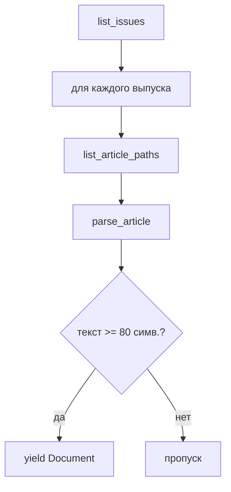

# Парсеры корпуса: подробное описание

Документ описывает **все модули сбора и извлечения текста** в репозитории: что парсится, как устроены URL, какие поля попадают в JSONL, ограничения и отличия от Colab-ноутбука.

См. также: [ARCHITECTURE.md](ARCHITECTURE.md) (общая схема), [PLAN.md](PLAN.md) (этапы НИР).

---

## 1. Обзор модулей

| Модуль | Файл | Тип | Назначение |
|--------|------|-----|------------|
| **База** | `src/collect/base.py` | утилиты | HTTP, `Document`, HTML→text, JSONL |
| **УФН** | `src/collect/ufn.py` | сайт-парсер | ufn.ru: выпуски → статьи → HTML + PDF |
| **PDF/OCR** | `src/collect/pdf_text.py` | извлечение текста | Скачивание PDF, raw/OCR, 2 колонки |
| **RSS** | `src/collect/rss_feed.py` | лента | WordPress/RSS/Atom |
| **CLI** | `scripts/scrape.py` | оркестратор | `ufn`, `rss`, `pilot` |
| **Пересборка** | `scripts/rebuild_from_pdf.py` | batch | OCR по уже скачанным PDF |

**Не является парсером в репо:** `draft/ru_phys_BERT.ipynb` — только скачивание PDF и HTML-метаданные (PACS/DOI), **без OCR и без извлечения текста из PDF**.

---

## 2. Базовый слой (`base.py`)

### 2.1. `Document`

Единая структура записи корпуса (dataclass):

```python
@dataclass
class Document:
    source: str          # "ufn.ru", "ufn.ru:rss", "quantum-electronics.ru:rss"
    url: str             # канонический URL статьи
    title: str
    text: str            # основной текст для ML
    authors: list[str]   # по умолчанию []
    published: str | None
    section: str | None  # рубрика журнала / категория RSS
    pdf_url: str | None
    language: str        # "ru"
    extra: dict          # служебные поля парсера
```

Сериализация: `doc.to_dict()` → одна строка JSONL через `append_jsonl(doc, path)`.

### 2.2. HTTP

- **`fetch_bytes(url)`** — бинарные данные (PDF), таймаут 120 с, до 3 повторов.
- **`fetch_html(url, encoding=...)`** — декодирование в строку.
- **User-Agent:** `NIR-corpus-bot/0.1 (+academic research; contact via GitHub DmitryO325)`.
- Между запросами парсеры сами делают `time.sleep(delay_sec)` (у УФН по умолчанию 1 с).

### 2.3. `html_to_text(fragment)`

Грубая очистка без BeautifulSoup (в отличие от Colab):

1. Удалить `<!-- -->`, `<script>`, `<style>`
2. `<br>` → перевод строки
3. Закрывающие `</p>`, `</div>`, … → перевод строки
4. Остальные теги → пробел
5. `html.unescape`, схлопывание пробелов и пустых строк

Подходит для RSS-описаний и блока `class="main"` на ufn.ru.

---

## 3. Парсер УФН (`ufn.py`)

### 3.1. Класс `UfnScraper`

```python
UfnScraper(
    delay_sec=1.0,
    text_mode="pdf+html",      # html | pdf | pdf+html
    pdf_dir="data/raw/pdf",
    pdf_text_dir="data/raw/pdf_text",
    min_pdf_chars=500,
    try_ocr=True,
)
```

| Параметр | Значение по умолчанию | Смысл |
|----------|----------------------|--------|
| `text_mode` | `pdf+html` | Сначала PDF; если нечитаемо — HTML-вступление |
| `min_pdf_chars` | 500 | Минимальная длина текста из PDF, иначе fallback |
| `try_ocr` | True | Tesseract, если `get_text()` даёт кракозябры |

**Кодировка сайта:** `windows-1251` (обязательно для HTML ufn.ru).  
**RSS УФН:** `utf-8` (`/ru/articles/rss.xml`).

### 3.2. Иерархия URL на ufn.ru

Три уровня (как в Colab, но реализовано в одном классе):

```
https://ufn.ru/ru/articles/                    ← архив выпусков
https://ufn.ru/ru/articles/2026/5/             ← страница выпуска (список статей a, b, c…)
https://ufn.ru/ru/articles/2026/5/a/           ← страница статьи (HTML)
https://ufn.ru/ufn26/ufn26_5/Russian/r265a.pdf ← PDF полного текста
```

**Правило имени PDF** (если ссылка не найдена в HTML):

```
/ru/articles/{YYYY}/{VOL}/{letter}/
  → https://ufn.ru/ufn{YY}/ufn{YY}_{VOL}/Russian/r{YY}{VOL}{letter}.pdf

Пример: /ru/articles/2026/5/a/ → r265a.pdf
```

Функция: `pdf_url_from_article_path()` в `pdf_text.py`.

### 3.3. Алгоритм обхода (`iter_articles`)



1. **`list_issues(limit)`** — GET `/ru/articles/`, regex  
   `href="(/ru/articles/\d{4}/\d+/?)"`, сортировка **от новых к старым**.
2. **`list_article_paths(issue_path)`** — GET страницы выпуска, regex  
   `href="(/ru/articles/YYYY/N/[a-z]/?)"`, опционально заголовок из текста ссылки.
3. **`parse_article(path)`** — одна статья → `Document | None`.
4. Лимиты: `max_issues`, `max_articles_per_issue`, `max_docs` (остановка после N успешных статей).

**Важно:** при `--max-docs 100` и без `--max-issues` обход идёт по **всем выпускам из архива**, пока не наберётся 100 статей (исправление старой ошибки с `max_issues=2` по умолчанию).

### 3.4. Парсинг HTML страницы статьи (`_parse_article_html`)

| Шаг | Действие |
|-----|----------|
| 1 | Найти блок `class="main"` (опционально `id="print"`) |
| 2 | Обрезать по маркеру `© Успехи` (футер) |
| 3 | Извлечь `href="....pdf"` → `pdf_url`, иначе построить по пути |
| 4 | `html_to_text` + `_drop_nav_prefix` → короткий текст |
| 5 | `_extract_title`, `_extract_authors`, `_extract_section` |
| 6 | `extra`: `issue_path`, `year` |

**Что попадает в HTML-текст:** аннотация, вводный абзац, PACS, DOI, ссылки на скачивание PDF — **не полная статья** (обычно 2–4 тыс. символов).

### 3.5. Извлечение метаданных

| Поле | Метод | Логика |
|------|--------|--------|
| **title** | `_extract_title` | Первые осмысленные строки plain text (≥12 симв.), без «выпуски», месяцев; fallback `<b>...</b>` |
| **authors** | `_extract_authors` | Regex по `<b>Иванов И. И. Петров</b>` в первых 8000 символах HTML |
| **section** | `_extract_section` | Одна из рубрик: «Обзоры актуальных проблем», «Конференции и симпозиумы», … |

PACS/DOI **в отдельные поля JSONL не выносятся** (в Colab были `info_pacs_list`, `info_doi_list`); они остаются внутри `text` при HTML-режиме или в OCR-тексте первой страницы PDF.

### 3.6. Режимы `text_mode`

| Режим | Поведение |
|-------|-----------|
| **`html`** | Только `_parse_article_html` → `text`, `text_source: html` |
| **`pdf`** | Только PDF; при ошибке/нечитаемости → `None` или пропуск |
| **`pdf+html`** (default) | `pdf_to_text()` → если OK и ≥ `min_pdf_chars` → PDF; иначе HTML, `pdf_unreadable: true` |

Дополнительная проверка: если метод вернул `pdf`, но `is_readable_russian()` = False → снова HTML.

Цепочка вызова PDF: `parse_article` → `pdf_to_text()` → `download_pdf` + `extract_best_text()` (см. раздел 4).

### 3.7. RSS внутри УФН (`parse_rss`)

- URL: `https://ufn.ru/ru/articles/rss.xml`
- Поля: `title`, `link`, `description` (HTML → text), `pubDate`
- `source`: `ufn.ru:rss`
- `extra.format`: `rss_description`
- **Без PDF** — только анонс из ленты.

### 3.8. Поля `extra` для УФН (типичные)

| Ключ | Когда | Пример |
|------|-------|--------|
| `text_source` | всегда | `html`, `pdf`, `pdf_ocr_layout`, `pdf_unreadable` |
| `issue_path` | из URL | `/ru/articles/2026/5/` |
| `year` | из URL | `"2026"` |
| `pdf_file` | при PDF | `r265b.pdf` |
| `pdf_path` | локальный путь | абсолютный путь к файлу |
| `pdf_extract_method` | при PDF | `pdf_ocr_layout`, `raw`, … |
| `pdf_text_file` | sidecar | `.../r265b_pdf_ocr_layout.txt` |
| `pdf_unreadable` | fallback | `true` |
| `pdf_error` | исключение при PDF | строка ошибки |
| `error`, `skipped` | сбой парсинга | запись-пустышка в потоке |

### 3.9. Очистка мусора (`_drop_nav_prefix`)

На ufn.ru в HTML иногда попадает мусор из комментариев (спам-ссылки). Фильтр:

- строки с `@`, `mail\d`, `Ud%`, `-->`, `$` — выкидываются;
- в начале пропускаются «выпуски», стрелки, голый год, названия месяцев;
- текст начинается с первой строки длиной > 25 символов.

---

## 4. Извлечение текста из PDF (`pdf_text.py`)

Это **не HTML-парсер**, а подсистема для бинарных PDF журнала УФН (и потенциально других источников с тем же API).

### 4.1. Зависимости

| Пакет / программа | Роль |
|-------------------|------|
| **pymupdf** (`fitz`) | Открытие PDF, рендер страниц в pixmap |
| **pytesseract** + **Tesseract** | OCR, язык `rus` |
| **Pillow** | PNG из pixmap для Tesseract |

Установка OCR (macOS): `brew install tesseract tesseract-lang`

### 4.2. Пайплайн `extract_best_text(pdf_path)`

```
extract_text_from_pdf()     # PyMuPDF page.get_text("text")
        │
        ├─ is_readable_russian? ──да──► метод "pdf", sidecar *_raw.txt
        │
        нет (кракозябры на УФН)
        │
        ▼
extract_text_from_pdf_ocr()  # Tesseract + layout
        │
        ├─ читаемо? ──► "pdf_ocr_layout", readable=True
        ├─ длина ≥ 500? ──► "pdf_ocr_layout", readable=False
        │
        ▼
"pdf_unreadable" + sidecar *_raw_unreadable.txt
```

**Критерий читаемости:** ≥ 200 символов и доля кириллических букв среди всех букв ≥ **12%** (`MIN_CYRILLIC_RATIO`).

### 4.3. Почему нужен OCR на УФН

PDF УФН использует встроенные шрифты **без Unicode CMap**. `page.get_text()` возвращает латиницу/мусор вместо кириллицы. Прямое извлечение почти никогда не проходит `is_readable_russian()` → всегда ветка OCR.

### 4.4. Двухколоночная вёрстка и первая страница

**Проблема:** Tesseract по умолчанию читает строки слева направо через всю ширину → текст левой и правой колонки перемешивается.

**Решение:**

| Страница | Режим |
|----------|--------|
| **0 (первая)** | Детекция `split_y`: где начинается gutter между колонками (после блока PACS/DOI, ~50% высоты). **Выше** `split_y` — OCR на **всю ширину** (шапка). **Ниже** — сначала **левая** половина, потом **правая**. |
| **1+** | Сразу **левая колонка целиком**, затем **правая** (`split_y = None`). |

**Детекция gutter (только page 0):**

- Grayscale-скан страницы 150 DPI;
- горизонтальные полосы по 12 px, начиная с **20%** высоты;
- score = (чернила слева + справа) / (чернила в центре 42–58% ширины);
- если score ≥ 8 два раза подряд → граница двух колонок;
- отступ `SPLIT_MARGIN_PT = 10` pt вниз.

**Разрез колонок:** середина страницы 50%, зазор между колонками `COLUMN_GUTTER_PT = 14` pt.

**OCR:** DPI **200**, Tesseract `--psm 6` (блок текста), язык `rus`.

### 4.5. Постобработка `_clean_pdf_lines`

Удаляются строки, состоящие только из номера страницы (1–4 цифры).

### 4.6. Sidecar-файлы

Путь: `data/raw/pdf_text/{stem}_{method}.txt`

Примеры имён метода:

| method | Содержание |
|--------|------------|
| `raw` | Успешный `get_text` (редко на УФН) |
| `pdf_ocr_layout` | OCR с учётом layout |
| `raw_unreadable` | Сырой мусор, OCR не помог |

Заголовок файла: метод, имя PDF, число символов, пометка про layout.

### 4.7. `pdf_to_text(url, cache_dir, ...)`

Высокоуровневая функция для `UfnScraper`:

1. Имя файла из URL → `r265a.pdf`
2. Если файл в кэше и > 1000 байт — **не скачивать** снова
3. Иначе `download_pdf`
4. `extract_best_text` → `(text, local_path, readable, method)`

---

## 5. Парсер RSS (`rss_feed.py`)

### 5.1. Класс `RssScraper`

Универсальный парсер лент **RSS 2.0** и **Atom** (без отдельных зависимостей — только `xml.etree`).

### 5.2. Ленты по умолчанию

```python
DEFAULT_FEEDS = {
    "quantum-electronics.ru": "https://quantum-electronics.ru/feed/",
    "ufn.ru": "https://ufn.ru/ru/articles/rss.xml",
}
```

### 5.3. Разбор элемента (`_parse_item`)

| Поле | Источник (по приоритету) |
|------|--------------------------|
| title | `<title>` |
| link | `<link>` или Atom `<link href="...">` |
| published | `<pubDate>` или `<date>` |
| text | `content:encoded` → `encoded` → `description` → `summary` → HTML→text |
| section | первая `<category>` |
| extra | `feed`, `categories` |

Минимальная длина текста для сохранения в CLI: **30** символов (`_save_docs` в `scrape.py`). Если тела нет — в `text` подставляется `title`.

`source` записывается как `{host}:rss`.

### 5.4. Отличие от `UfnScraper.parse_rss`

| | `RssScraper` | `UfnScraper.parse_rss` |
|---|--------------|------------------------|
| Использование | `scrape.py rss` | `scrape.py ufn --rss` |
| Atom | поддерживается | только RSS items |
| categories | да | нет |
| feed в extra | да | нет |

Логика для ufn.ru по сути та же (description → text).

---

## 6. CLI (`scripts/scrape.py`)

### 6.1. Команды

| Команда | Действие |
|---------|----------|
| `pilot` | 1 выпуск УФН (≤4 статьи) + RSS (8 записей) → `data/raw/corpus.jsonl` |
| `ufn` | Полный обход УФН с PDF/HTML |
| `rss` | Одна или все `DEFAULT_FEEDS` |

Общие флаги: `-o` / `--output`, `--delay`, `--fresh` (удалить output перед стартом).

### 6.2. `ufn` — все флаги

| Флаг | По умолчанию | Описание |
|------|--------------|----------|
| `--max-docs` | — | Стоп после N статей |
| `--max-issues` | — | Только N последних выпусков |
| `--max-articles` | — | Лимит статей на выпуск |
| `--text-source` | `pdf+html` | Источник текста |
| `--pdf-dir` | `data/raw/pdf` | Кэш PDF |
| `--pdf-text-dir` | `data/raw/pdf_text` | Sidecar TXT |
| `--min-pdf-chars` | 500 | Порог для принятия PDF |
| `--no-ocr` | false | Отключить Tesseract |
| `--rss` | false | Добавить RSS ufn в тот же JSONL |

Записи с `extra.skipped` или `len(text) < 30` в RSS не пишутся; для `ufn` в поток идут и ошибочные заглушки с `skipped` (но `iter_articles` их не считает в `saved`).

---

## 7. Пересборка (`scripts/rebuild_from_pdf.py`)

Отдельный **batch-процесс** без повторного crawl:

1. Читает существующий JSONL (`-i`, например `ufn_100.jsonl`)
2. Для каждой строки берёт `extra.pdf_file` из `data/raw/pdf/`
3. Вызывает `extract_best_text()` (актуальная версия OCR/layout)
4. Обновляет `text`, `text_source`, `pdf_extract_method` → пишет в `-o`

| Флаг | Назначение |
|------|------------|
| `-n` / `--limit` | Обработать только N статей |
| `--no-ocr` | Только raw `get_text` |
| `--fresh` | Удалить output перед записью |

Пропуск, если: нет `pdf_file`, нет файла на диске, текст нечитаем и короткий.

**Зачем:** OCR и layout менялись после первого `scrape`; пересборка не качает сайт заново.

---

## 8. Сравнение с Colab (`draft/ru_phys_BERT.ipynb`)

| Возможность | Colab | Репозиторий |
|-------------|-------|-------------|
| HTTP | `requests` | `urllib` + User-Agent |
| HTML | `BeautifulSoup` | regex + `html_to_text` |
| Обход выпусков/статей | циклы + tqdm | `UfnScraper.iter_articles` |
| `download_pdf` | да | `pdf_text.download_pdf` |
| PACS/DOI в отдельные списки | да | нет (внутри `text`) |
| Извлечение текста из PDF | **нет** | `pdf_text.py` |
| OCR / Tesseract | **нет** | да |
| 2 колонки | **нет** | да (`pdf_ocr_layout`) |
| JSONL корпус | нет (списки / Drive) | `append_jsonl` |
| RSS | нет | `RssScraper` |

---

## 9. Ограничения и известные проблемы

1. **HTML УФН** — неполный текст статьи; для MLM нужен PDF+OCR.
2. **OCR** — медленно (~минуты на статью), ошибки в формулах и сносках.
3. **Граница 1col/2col** — эвристика; на отдельных PDF может съехать на ±5–10%.
4. **Авторы** — regex по `<b>`, не все шаблоны имён покрыты.
5. **Rate limit** — только `delay_sec`, без параллелизма (намеренно, бережно к сайту).
6. **Другие журналы** из плана (ЖЭТФ, sciencejournals.ru) — **парсеров нет**, только заготовка RSS.
7. **Юридическое** — материалы УФН; для корпуса нужно учитывать правила журнала (см. PLAN.md).

---

## 10. Примеры команд

```bash
# Пилот
python scripts/scrape.py pilot

# 100 статей УФН, PDF + OCR + fallback HTML
python scripts/scrape.py ufn --max-docs 100 --fresh -o data/raw/ufn_100.jsonl

# Только HTML (быстро, короткий текст)
python scripts/scrape.py ufn --text-source html --max-docs 20 -o data/raw/ufn_html.jsonl

# RSS все ленты по умолчанию
python scripts/scrape.py rss --limit 30 -o data/raw/rss.jsonl

# Пересобрать текст из PDF после правок OCR
python scripts/rebuild_from_pdf.py \
  -i data/raw/ufn_100.jsonl \
  -o data/raw/ufn_100_pdf.jsonl \
  --fresh
```

---

## 11. Как добавить новый журнал (шаблон)

1. Создать `src/collect/<site>.py` с классом `*Scraper`.
2. Реализовать обход списка статей → `parse_article` → `Document`.
3. Если есть PDF — переиспользовать `pdf_text.pdf_to_text` или свой extractor.
4. Подключить подкоманду в `scripts/scrape.py`.
5. Описать URL, кодировку, лимиты в этом файле (новый подраздел).

Для WordPress-сайтов часто достаточно только `RssScraper` + новая запись в `DEFAULT_FEEDS`.
